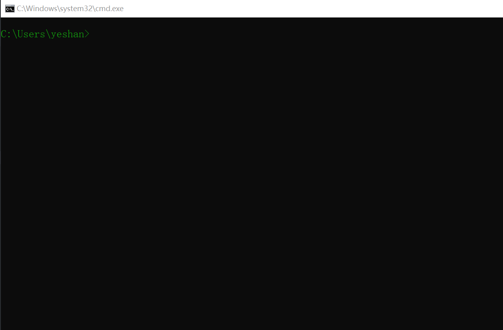

# 谈谈初心

> 记性真的不行了，最近看一些文章明明有些技术名词是学过的，就是想不起来是怎么个回事。一直有个想法把碰到的一些碎片化的知识点整理一下，虽然有自己的个人博客，但是觉得一些碎片化的知识不太适合放到上面去（开始追求高质量写作了，此处叹息🙄），虽然大多数的东西都可以搜索得到，但搜索到的内容质量有待商榷。还是记一记吧，能系统化整理还是不错的，顺便装bi(逃~~。启航⛵！-2019年12月20日

!> “低能”预警⚠



# 关于我

?> 请路过的大佬无视此处，

```rust
#![allow(unused_variables)]
fn main() {
    use std::collections::HashMap;

	let mut yeshan = HashMap::new();

	yeshan.insert(String::from("id"), String::from("ShanSan"));
	yeshan.insert(String::from("role"), String::from("Web Developer"));
	yeshan.insert(String::from("location"), String::from("China"));

	for (key, value) in &yeshan {
    	println!("{}: {}", key, value);
	}
}
```

## 社交

?> 个人博客: [Link🔗](https://shansan.top)

?> GitHub: [Link🔗](https://github.com/yeshan333)

?> Twitter: [Link🔗](https://twitter.com/CloudysYe)

?> Slides: [Link🔗](https://slide.shan333.cn)
